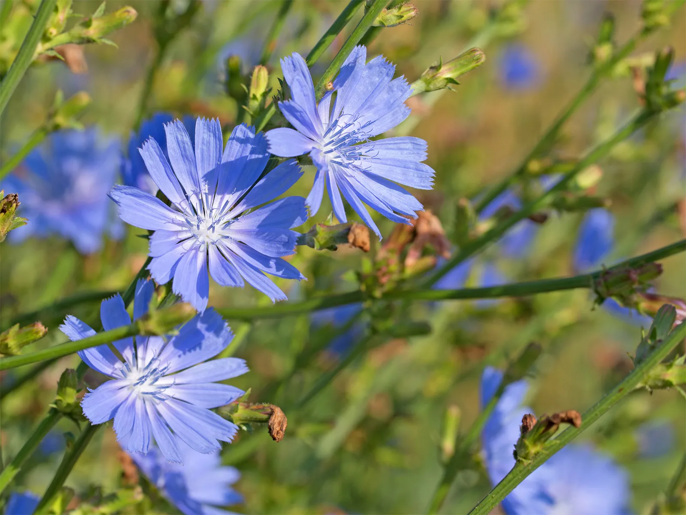

# 🌿 Cichorium intybus, Common Chicory

A chicória, (Cichorium intybus) é uma planta perene de flor azul da família Asteraceae. Nativa da Europa e introduzida nos Estados Unidos no final do século XIX, a chicória é cultivada extensivamente na Holanda, Bélgica, França e Alemanha e, até certo ponto, na América do Norte.

## 🍳 Uso gastronômico

Suas folhas são consumidas como verdura ou em salada, e as raízes podem ser fervidas e consumidas com manteiga.

A raiz de chicória pode ser torrada e moída para conferir cor, corpo e amargor adicionais ao café - algumas pessoas acham que tem gosto de café queimado.

> Como a chicória podia ser cultivada em partes da Europa onde o café não podia, era mais barata e mais facilmente disponível. Foi levado para a América pelos colonizadores europeus em 1700. Desde então, a chicória foi naturalizada em todo o continente norte-americano.

> Livre de cafeína.

> O cultivo da chicória também tem um impacto muito menor no meio ambiente quando você mesmo o cultiva, em comparação com o café

Nos últimos anos, os fabricantes têm adicionado ingredientes como a raiz de chicória a uma gama de produtos – incluindo biscoitos, água e cereais – para aumentar o teor de fibra dos alimentos e bebidas.

Falando em benefícios para a saúde, houve pelo menos um [estudo em animais](https://pubmed.ncbi.nlm.nih.gov/15877889/) que mostra que a chicória pode ajudar os indivíduos a controlar a diabetes e a obesidade.

## 💊 Uso medicial

A chicória não é conhecida por ser tóxica, mas pode causar dermatite de contato em humanos.

## 🔍 Outras informações

A chicória comum também é conhecida como Margarida Azul, Dente-de-leão Azul, Marinheiros Azuis, Erva Azul, Beliche, Erva Daninha de Café, Hendibeh, Horseweed, Marinheiros Esfarrapados, Succory, Botões Wild Bachelors e Endívia Selvagem.

A chicória tem uma raiz principal longa e carnuda e um caule rígido, ramificado e peludo que atinge uma altura de cerca de 1 a 1,5 metros (3 a 5 pés).

Suas folhas lobadas e dentadas, na chicória selvagem, semelhantes em aparência às folhas do dente-de-leão, nascem ao redor da base.

# Referências

1. Britannica. Disponível em: <https://www.britannica.com/plant/chicory>;

2. PennState Extension. Disponível em: <https://extension.psu.edu/chicory-weed-or-flower>;

3. NatureScape. Disponível em: <https://www.naturescape.co.uk/product/chicory/>

4. Gardner's Path. Disponível em: <https://gardenerspath.com/plants/herbs/grow-chicory/> e <https://gardenerspath.com/plants/herbs/health-benefits-uses-chicory/>;
